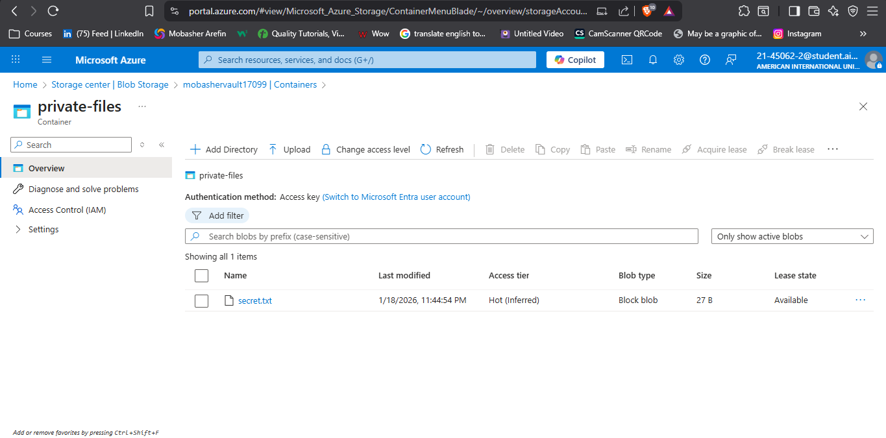

# 🔒 Azure Cloud Security: SAS Implementation & Access Control
### Enforcing Principle of Least Privilege (PoLP) on Object Storage

This repository demonstrates a production-level security workflow on Microsoft Azure. I implemented **Shared Access Signatures (SAS)** to secure private data, ensuring that access is time-bound, granular, and does not expose master account keys.

---

## 🎯 The Challenge
Sharing sensitive cloud assets (e.g., private documents) often leads to security risks if public access is enabled or if Account Master Keys are shared. 

## ✅ The Solution
I implemented a **SAS-based authentication** strategy that provides:
1. **Temporal Access:** Links expire automatically after a set duration.
2. **Granular Permissions:** Restricted to 'Read-only' access to prevent data modification.
3. **Auditability:** Secure URI generation via Azure CLI for automated workflows.

---

## 🛠️ Security Implementation Steps

### 1. Provisioning Private Container
Created a dedicated container `private-files` with **Private (no anonymous access)** level.

**📸 Proof:** 
*(Description: Azure Portal view confirming the creation of a private-access container.)*

### 2. Secure File Upload & SAS Generation
Uploaded a sensitive document (`secret.txt`) and generated a signed SAS URI with an expiry timestamp.

**Command:**
```bash
az storage blob generate-sas \
    --account-name mobashervault17099 \
    --container-name 'private-files' \
    --name secret.txt \
    --permissions r \
    --expiry 2026-01-20T00:00:00Z \
    --full-uri --auth-mode key